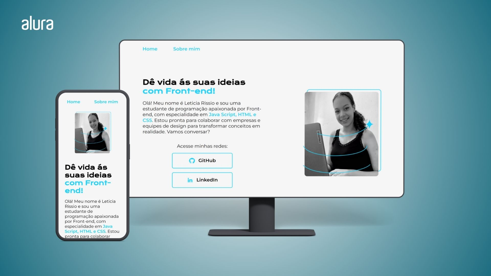
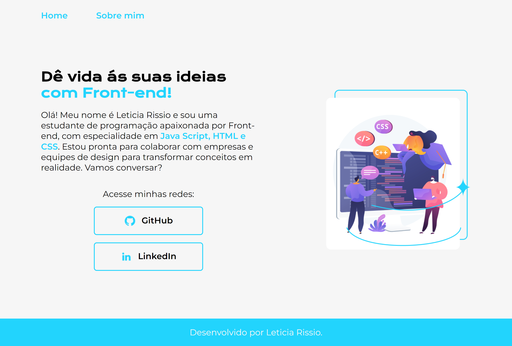
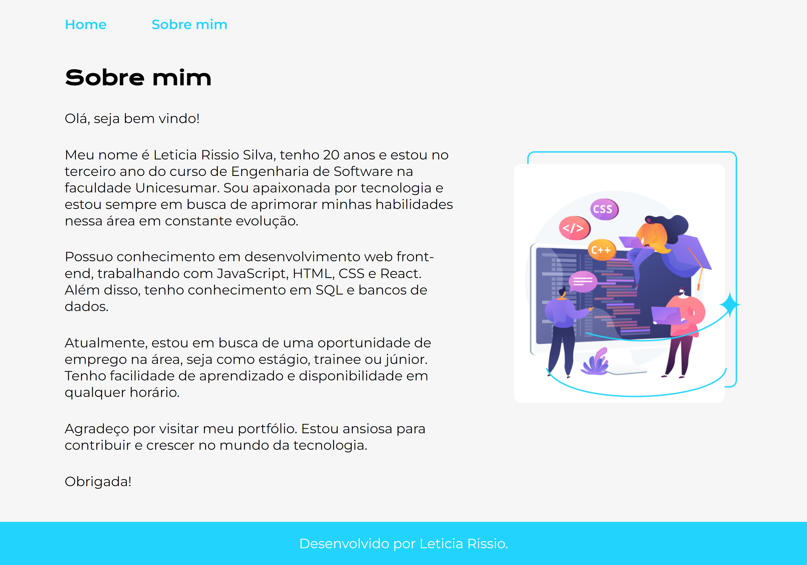

<h1 align="center"> Projeto - Portifólio</h1>

 Este é um projeto desenvolvido durante as aulas de 4 cursos pertencentes formação da Alura <a href="https://cursos.alura.com.br/degree/certificate/2e85c664-e5e4-450f-9994-074e43c763e0?lang=pt_BR">A partir do Zero: HTML e CSS para Projetos Web.</a> 
Possui uma página "Home" e "Sobre mim", que foi feita utilizando os conceitos de Flexbox e com foco em responsividade para diversos tamanhos de tela. 

 
 

  

    <h3>Páginas completas do projeto</h3> 
    
    

 

## 🚀 Tecnologias
* HTML e CSS
* Flexbox
 

## 💻 Projeto
Para visualizar a última vesão do projeto clique abaixo:
 
 
Visite o [projeto](https://portifolio-alura-ten-eosin.vercel.app/) online.
 
 

## Cursos Relacionados

### HTML e CSS: Ambientes de Desenvolvimento, Estrutura de Arquivos e Tags
* [Ver certificado](https://cursos.alura.com.br/certificate/a22f5ecc-3066-47ca-9fa8-87f161f04526?lang=pt_BR)

### HTML e CSS: Classes, Posicionamento e Flexbox
* [Ver certificado](https://cursos.alura.com.br/certificate/b2801ca3-bfd0-4d8b-8436-ea77637e1a26?lang=pt_BR)

### HTML e CSS: Cabeçalho, Footer e Variáveis CSS
* [Ver certificado](https://cursos.alura.com.br/certificate/64481a1c-5a7b-4118-bb08-5d50e6473e88?lang=pt_BR)

### HTML e CSS: Trabalhando com Responsividade e Publicação de Projetos
* [Ver certificado](https://cursos.alura.com.br/certificate/dbba3570-7cc8-470e-a85b-b9d44c512004?lang=pt_)
 

---

Feito com muito ♥

Obrigado por visitar meu Github ♥
Me dê um "FOLLOW" que retribuo, vamos criar novas conexões 😊

Até a próxima! 👋😊
